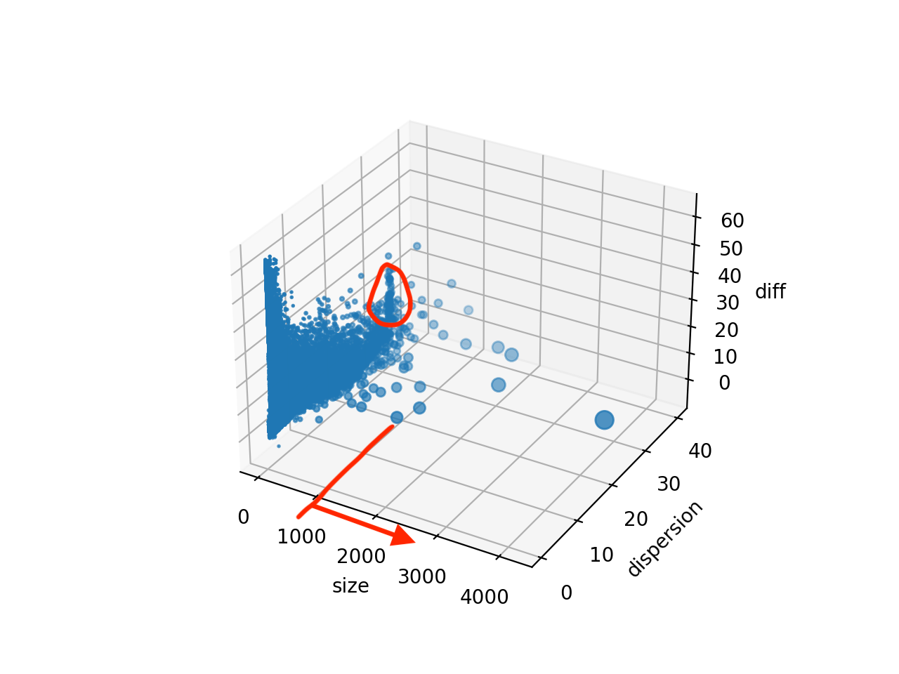

# interesting_OG
可能感兴趣的OGs, 包括Size大于1000，以及特定条件（diff大于22，dispersion大于25）下的group。 如下图所示：
你可以在[http://140.143.22.172:8050/](http://140.143.22.172:8050/)查看可以选择的三维图

每个文件中分别有两个文件夹，一个是OG的网络信息，以边表形式存在；一个是使用cytoscape(或者python networkx包）画出的网络图。
