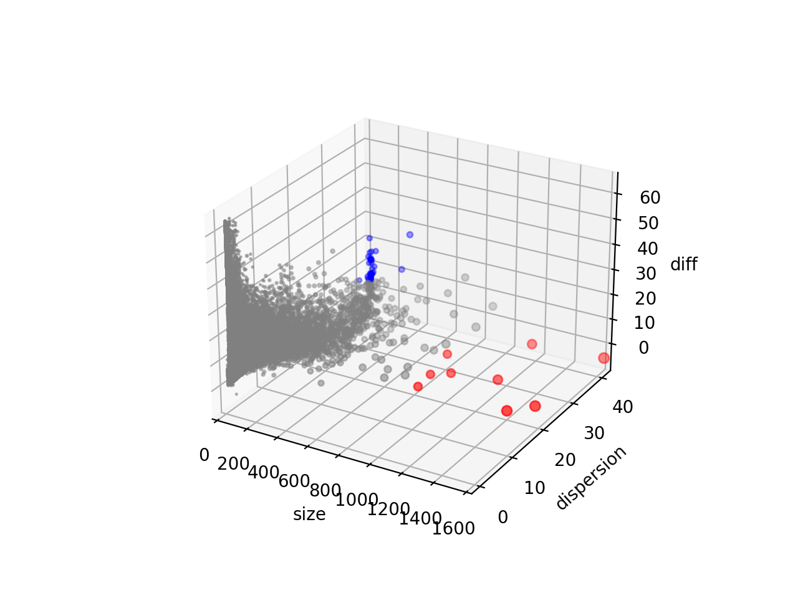

# interesting_OG
可能感兴趣的OGs, 包括Size大于1000，以及特定条件（diff大于22，dispersion大于25）下的group。 如下图所示：
你可以在[http://140.143.22.172:8050/](http://140.143.22.172:8050/)查看可以旋转的三维图

上图是使用平均值计算画出的，下图是使用中位数画出的：

每个文件中分别有三个文件夹，一个是OG的网络信息，以边表形式存在（edges_networks）；一个是节点序号与原始的ID信息的对应关系（nodes_original_ID），一个是使用cytoscape(或者python networkx包）画出的网络图（picture）。
